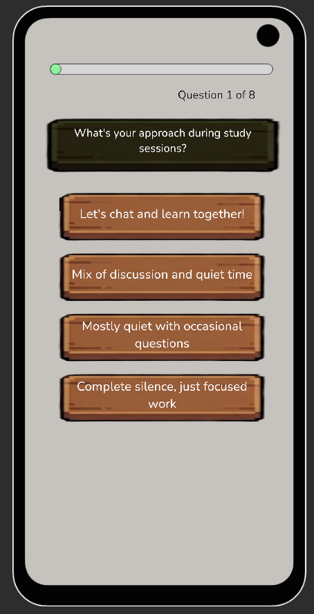

# Studygram DPM 5 Report
Gamify Labs: Alua Kaliazhdarova, Johan Ronnquist, Sche In Baek, Olesia Bilyk
## Quality Arguments
University students study alone instead of meeting new people to study together. Our app gamifies the process and matches students to work on the coursework together, making the process of studying less isolated and thus more efficient. Our approach emphasizes long-term teamwork through **matching** within class based on learning type of students, smoothened one-click **group study sessions**, and shared resources that all group members contribute to by collaborating on **shared flashcard sets**, which results in imprved learning habits and efficiency through collaboration.

## Deployment Summary
Our deployment included 5 KAIST undergraduates testing the app over a week-long period (it included people of three genders and from three countries; there was no point in diversifying the age since our target group is college students). They were assigned to two groups, with a member of our team in each for assistance. Instead of introducing our goal and core tasks to the users, we said that it's an app for social studying to see how intuitive the features and rules are.

The users found the app intuitive to use, but suggested that "introducing tooltips once the game starts might be useful". All of the users enjoyed the gamification design, both ones who appreciated the social aspect of Studygram (suggesting future improvement of "could be enhanced further whether friends could send each other support words") and ones who did not ("Why do i need to buy flashcards😭😭😭 I just wanna study" whereas the flashcard purchase was implemented so that students need to first get money by contributing to the group with session participation or card creation in order to get access to the shared resources), which suggests that studying-related apps in general could benefit from gamification.

Users agreed that Studygram reduces the initiation awkwardness (poll options ranging from 1 - "Not at all" to 5 - "Very much so"), and the majority would like to use the app for their real coursework. The experience could be improved if the users "were able to communicate with each other somehow", could "have a companion website to upload questions on to", or could preview flashcards before purchase ("can't really see them before buying"), among other things. The general consensus of the users was that the app does achieve its goal and is "really needed among super introverted KAIST students".

## Discussion
When we designed Studygram, we thought deeply about several social computing concepts to solve the problem of student isolation. We wanted to understand what actually motivates people to work together.

### Incentives for Participation

We used a mix of rewards to keep users engaged. We realized that just giving people points, which is an extrinsic reward, often leads to burnout. It creates short-term activity but not long-term commitment. That is why we designed the Social Garden. It taps into intrinsic motivation and social pressure in a positive way. Since the garden only grows when the whole team studies, it changes the motivation. Users start participating because they want to help their group thrive rather than just to get a high score for themselves.
### Supporting Social Interaction
A key lesson we learned is that being social does not always require active talking. Many existing tools fail because they force shy students to chat or turn on their video. We focused on the idea of passive presence. By allowing avatars to move around a shared virtual room, we recreated the feeling of a quiet library. You feel the comfort of being around others without the stress of forcing a conversation. This lowers the barrier for introverted students to feel connected. It proves that just being present is a powerful form of social interaction.
### Matching and Homophily
Our matching system addresses the challenge of forming a good team. Randomly assigned groups often fail because the members have different expectations. We used the concept of homophily, which is the idea that people get along better with those who are similar to them. By grouping students based on their Learning Types, such as Visual Learner or Grinder, we ensure that teams start with compatible study styles. This similarity reduces the friction when the group first meets and helps them trust each other faster.
### Privacy and Ethics
Finally, we treated privacy as a bridge rather than a barrier. We intentionally do not require real names at the start to reduce the fear of judgment. This anonymity allows users to interact based solely on their study habits without social anxiety. However, we recognize that the ultimate goal is connection. By using the app as a safe buffer to build trust first, users can eventually choose to take their study group into the real world. The system lowers the initial risk of approaching a stranger, making that optional transition to offline meeting much safer and more comfortable.

### URLs
You can download our renewed .apk prototype through the following [link](https://drive.google.com/file/d/14_wDQM7ZANa9IOcMF33LQf6yoTR1DyJP/). Please refer to the previous report for the emulator usage if needed.\
[Our Git Repository](https://github.com/sbaek293/Studygram/)

